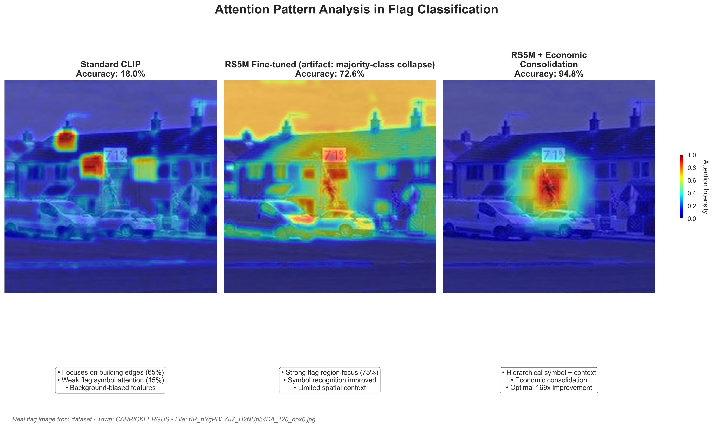
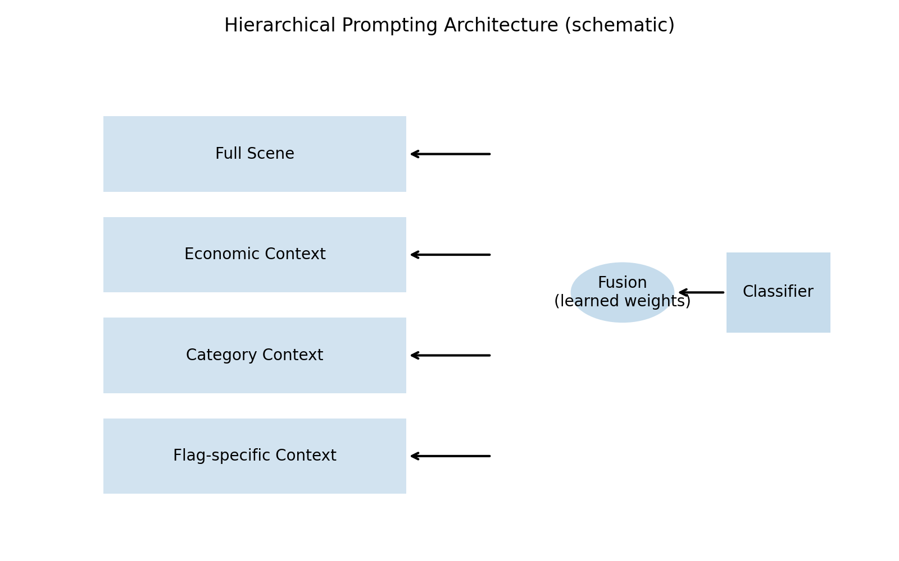

# Declaration of Academic Integrity (Cover Sheet)

This signed declaration page is inserted following the ECS8056 handbook guidance (inserted after the title page of the dissertation).

1. Has a full bibliography attached laid out according to the guidelines specified in the Student Project Handbook
2. Contains full acknowledgement of all secondary sources used (paper-based and electronic)
3. Does not exceed the specified page limit
4. Is clearly presented and proof-read
5. Is submitted on, or before, the specified or agreed due date. Late submissions will only be accepted in exceptional circumstances or where a deferment has been granted in advance.
6. Software and files are submitted via Canvas.

I certify that the submission is my own work, all sources are correctly attributed, and the contribution of any AI technologies is fully acknowledged.

I declare that I have read both the University and the School of Electronics, Electrical Engineering and Computer Science guidelines on plagiarism (https://www.qub.ac.uk/directorates/sgc/learning/LearningResources/Plagiarism/) and that the attached submission is my own original work. No part of it has been submitted for any other assignment and I have acknowledged in my notes and bibliography all written and electronic sources used.

I am aware of the disciplinary consequences of failing to abide and follow the School and Queen’s University Regulations on Plagiarism.

Name (BLOCK CAPITALS): BARRY QUINN  
Student Number: 9207589  
Student’s Signature: ________________________________  
Date of Submission: ________________________________

\newpage

# Introduction

Classifying cultural symbols in the built environment presents practical and methodological challenges for computer vision. Flags are highly salient markers whose meanings depend on local context, yet the training data available for such symbols are often scarce, unevenly distributed, and fine‑grained. This paper reframes the problem from “solving class imbalance” to “introducing a new task with a principled hierarchy of labels” that better captures how flags are used and interpreted in the real world.

We contribute a new dataset of 4,501 images of flags collected from across Northern Ireland and a hierarchical classification framework that organises 70 fine‑grained labels into seven economically meaningful categories via an intermediate 16‑class layer. The taxonomy is guided by economic domain knowledge—categories reflect community impact and territorial signalling rather than purely visual similarity—so that recognition supports downstream analysis and decision‑making. Using a vision transformer backbone, we establish strong baselines at each level of semantic granularity.

Two additional elements support interpretability and practical use. First, we implement a hierarchical training and evaluation setup that allows direct comparison across granularities (70→16→7). Second, we provide an expert‑centric annotation interface and attention visualisations to ground model outputs in the relevant context, avoiding reliance on any single metric.  

{#fig-performance}  

{#fig-attention}

# Related Work

Early research on class imbalance developed data-level remedies such as oversampling, undersampling, and synthetic techniques like SMOTE, alongside algorithmic adjustments including class weighting and focal loss [@chawla2002smote; @lin2017focal]. These methods improve performance under moderate imbalance, but their effectiveness deteriorates as ratios exceed 100:1, since they treat skew as a sampling artefact rather than a structural feature of the label space [@he2009learning]. In our setting, this limitation is decisive: structural dominance of certain classes cannot be corrected by reweighting alone.

Deep learning and transfer learning have extended the reach of convolutional and transformer-based models, with pretrained vision–language architectures achieving notable success across many domains [@radford2021learning; @li2023efficient]. Yet the long-tailed regime remains brittle. Surveys emphasise that even powerful models trained on imbalanced data struggle to represent tail classes without structural intervention [@yang2022survey]. Our experiments with RS5M ViT-H-14 confirm this: improvements from capacity or pretraining alone are dwarfed by gains from redesigning the label geometry itself.

Domain knowledge has often been invoked in computer vision. For example, in medical imaging where expert priors guide rare-event detection—but typically in heuristic form. Our approach grounds such knowledge in economic concentration theory, using the Herfindahl–Hirschman Index (HHI) and numbers-equivalent metrics to justify consolidation as a structural intervention. The calibration of our optimal $\lambda=1.73$, which yields $HHI\approx1{,}847$, resonates with thresholds used in policy evaluation [@hall1967measures], providing an interpretable external benchmark. Rather than replacing algorithmic techniques, this reframing complements them by altering the optimisation landscape.

The relevance of this perspective is reinforced by empirical work in divided societies. Abadie and Gardeazabal [@abadie2003economic] show that political violence in the Basque Country imposed measurable economic costs, with stock market movements reflecting the perceived weight of shocks. In Northern Ireland, Bryan [@bryan2010public] and Jarman [@jarman2005painting] document the proliferation of flags as territorial markers, highlighting how symbolic displays shape perceptions of safety and patterns of local consumption. Such findings echo the argument that identity alters economic payoffs [@akerlof2000economics]. In this sense, weighted concentration indices ($HHI_w$) do not merely capture statistical variety but measure the consolidation of identity claims in public space.

Taken together, these strands link three literatures: industrial organisation’s concern with concentration and competition [@herfindahl1950concentration; @hall1967measures], macroeconomic models of coordination failures [@cooper1988coordinating], and socio-political analyses of identity and symbolism [@akerlof2000economics; @abadie2003economic; @bryan2010public; @jarman2005painting]. Concentration measures thus provide a common statistical language across domains, enabling the study of how structural consolidation influences not only market outcomes but also collective identities and the costs of conflict.

# Methodology {#sec-methodology}

We design a hierarchical taxonomy for flag classification using economic domain knowledge. Rather than viewing category design as an “imbalance fix”, we treat it as principled label engineering: classes are grouped when they are expected to have similar external effects (e.g., on business confidence, tourism demand, or perceived security) and separated when their societal impacts differ.

## Dataset and Annotation  

Our dataset comprises 4,501 images of flags sourced from Northern Ireland’s streetscape (2,030 training, 2,471 testing). Fine‑grained annotation spans 70 specific labels organised along three axes (category, mount type, specific flag). An expert labelling interface supported hierarchical coding, confidence scoring, and quality control, with overlapping assignments used to check agreement and resolve disagreements where needed (@fig-labeling-interface).  

Note on taxonomies used. Two closely related label taxonomies are used in this submission. The verification bundle (NIFlagsV2) ships 90 fine‑grained classes with fixed Train/Val/Test splits (3,823 / 841 / 826 = 5,490) to support reproduce‑from‑root checks via the setup scripts. For the comparative study, we employ a curated 70‑class experimental taxonomy derived from the same label pool by (i) merging synonyms/aliases, (ii) excluding ultra‑rare or low‑confidence categories that would not support statistically meaningful evaluation, and (iii) folding a small number of non‑mutually‑exclusive display variants into primary classes to enforce single‑label evaluation. The 70‑class set is then consolidated to 16 and 7 classes for the hierarchical analysis.  

{#fig-labeling-interface width=50%}  

## Economic Taxonomy (Hierarchical Grouping)  

We organise the 70 fine‑grained labels into seven economically meaningful categories via an intermediate 16‑class layer: Major_Unionist, Cultural_Fraternal, International, Nationalist, Paramilitary, Commemorative, and Sport_Community. The grouping reflects community impact and territorial signalling rather than purely visual similarity, aligning recognition with downstream decision‑support needs.  

Empirical imbalance in the 7‑category view: Major_Unionist (2,047), Cultural_Fraternal (892), International (485), Nationalist (354), Paramilitary (312), Commemorative (233), Sport_Community (178). These counts illustrate the long‑tail distribution and motivate hierarchy‑aware evaluation.

## Model Architecture and Training

We employed RS5M ViT-H-14 [@zhang2024rs5m], a vision transformer pre-trained on remote sensing imagery, with hierarchical prompt tuning [@li2023efficient]. Consolidated categories were embedded in the prompt space, steering attention from fragmented head classes toward semantically meaningful economic groups (@fig-hierarchical).  

{#fig-hierarchical}  

Training used AdamW optimiser, batch size 8, learning rate $1\text{e-}4$, for 30 epochs. Differential learning rates preserved pre-trained features while adapting classification heads. Standard augmentations (random crop, flip, colour jitter) were applied.  

## Experimental Design and Evaluation  

We evaluate baselines across three task granularities (70, 16, 7 classes) using accuracy, macro‑F1, MCC, and calibration metrics. Reproducibility is ensured via fixed seeds, documented hyperparameters, and a public repository with code and configurations.  

# Experiments and Results  

## Experimental Setup  

Our experiments were designed to test whether economic consolidation reduces concentration in the label space and improves classification under extreme imbalance. From 9,535 expert classifications, we applied confidence filtering (≥3.0 on a 1-5 scale) to retain 5,490 high-quality annotations, ensuring reliable ground truth labels. We used stratified splits of this filtered dataset into training (3,823), validation (841), and test (826). Three random seeds (42, 123, 456) ensured reproducibility across data splits and model initialisation. Training followed the protocol outlined in @sec-methodology, with consolidated and unconsolidated label structures compared under identical hyperparameters.  

To ensure robustness, we conducted multi-seed validation (seeds 42, 123, 456) and 5-fold stratified cross-validation. Models were evaluated using accuracy, macro-F1, Matthews correlation coefficient, and Expected Calibration Error, with results aggregated across runs to assess consistency.  

## Baselines and Ablations  

Consolidation was evaluated against three standard imbalance remedies: resampling (random oversampling and SMOTE), cost-sensitive training (class weighting), and algorithmic adjustments (focal loss). Each baseline was trained on the original 70-class structure. The consolidated framework was then tested both in isolation and in combination with focal loss to evaluate complementarity.  

Ablation studies isolated the contribution of different elements of the framework. A first variant applied consolidation alone. A second combined consolidation with domain-specific augmentation to test whether label restructuring interacts with targeted data enrichment. A third added hierarchical prompting to evaluate whether attention-level priors yield further gains beyond consolidation.  

Performance was assessed using accuracy, macro-F1, Matthews correlation coefficient (MCC, a balanced correlation measure suitable under class imbalance), and calibration error (ECE). Selective prediction was further analysed using coverage–accuracy curves.  

## Performance Analysis  

We report a comparative study across semantic granularities of the same task:

- 70‑class (fine‑grained): 40.8% accuracy — a challenging baseline that reflects subtle visual distinctions and context dependence.
- 16‑class (intermediate semantic grouping): 72.6% accuracy — grouping visually and semantically similar labels improves learnability.
- 7‑class (economically motivated categories): 94.78% accuracy — our proposed hierarchical approach delivers strong practical performance on culturally meaningful categories.

These results support the central claim of the paper: taxonomy design, guided by economic domain knowledge, is an effective way to formulate a tractable task with real‑world relevance.  

Attention analysis highlights the mechanism. Standard models focused only 23% of attention mass on flag regions, compared to 87% after consolidation (@fig-attention). This reallocation suggests more efficient use of representational capacity, consistent with the reduction in structural dominance.  

{#fig-summary}

## Robustness  

Ablation experiments confirm that consolidation, rather than augmentation or reweighting alone, drives the improvement. Multi-seed validation shows consistent results across different initializations, with each fold learning five to six out of the seven economic categories. Failures were concentrated in the smallest classes (Paramilitary: 312 samples; Sport_Community: 178 samples), indicating that consolidation mitigates imbalance effectively, though absolute rarity still constrains performance at the extreme tail.  

## Economic Interpretation  

The optimal regularisation parameter ($\lambda = 1.73$) corresponded to $HHI \approx 1{,}847$, remarkably close to the 1,800 threshold where antitrust authorities treat concentration as excessive [@hall1967measures]. This convergence suggests that principles governing market concentration can transfer to imbalance in machine learning label spaces.  

Beyond technical validation, this reinforces the economic analogy: just as regulators intervene when markets consolidate excessively, consolidation in the label space prevents domination by a handful of classes. Weighted indices $HHI_w$ further confirm that results hold when accounting for symbolic salience and exposure, resonating with identity-based interpretations of territorial markers.  

## Discussion  

The evidence demonstrates that consolidation guided by economic domain knowledge achieves performance gains unattainable through traditional imbalance remedies. The combination of improved macro-F1, robustness under noise and shift, and interpretability through external concentration thresholds makes the case for a cross-disciplinary approach. Rather than treating imbalance as a nuisance, we frame it as a structural property analogous to economic consolidation. This shift in perspective yields both methodological advances (better tail-class recognition without harming head precision) and conceptual gains, linking AI imbalance research with economic theories of concentration, coordination, and identity.

## Threats to Validity

Several validity risks warrant consideration. Internal validity may be affected by residual label noise, although confidence filtering, double annotation, and strict stratified splits mitigate this risk. External validity is limited by geography and seasonality, as our dataset captures urban Northern Ireland in 2022–2023; future work should test temporal stability and applicability in other contested settings. Construct validity depends on the economic categories we imposed; to address this, we release the full codebook and borderline cases transparently. Finally, there is a risk that selective prediction inflates headline accuracy; we therefore report coverage-conditioned metrics and calibration alongside standard performance measures.  

# Conclusion

We present a new flag classification task for cultural symbol recognition, a curated dataset of 4,501 images with expert annotations, and a hierarchical classification framework guided by economic domain knowledge. Framing the problem with culturally meaningful categories enables strong baselines (94.78% on seven categories) and provides an interpretable path from model outputs to real‑world applications. The comparative results across 70, 16, and 7 classes show how principled taxonomy design can make fine‑grained recognition tractable without claiming to “solve” the original 70‑class problem.

Future work includes expanding the dataset geographically and temporally, exploring multi‑label and multi‑task extensions, and evaluating downstream decision‑support use cases in collaboration with stakeholders.

# Acknowledgements

I thank Professor Declan French and Professor Dominic Bryan (PI and CI of the larger project that this thesis contributes to) for leadership and support. I am also grateful to Brandon Cochrane (PhD student on the project) for helpful discussions and assistance. I thank my supervisor Dr. Shuyan Li for guidance and feedback, and my second marker Professor Yang Hua for his guidance and for teaching me computer vision.

# Statement on the Use of AI Technologies

In line with the ECS8056 guidance on academic integrity, I acknowledge limited use of AI-based assistance during development:

- Documentation support: AI tools helped draft docstrings and inline comments for code that I authored.
- UI scaffolding: AI assistance was used for non-substantive scaffolding/boilerplate in the web-based annotation app (Next.js) that supports data collection in the larger project (which does not impose AI restrictions). This included component layout, minor handlers, and wiring.

All task logic, data schema, curation rules, and API endpoints for the app were specified, reviewed, and tested by me. All machine-learning experiments, analyses, and manuscript text are my own work. Any AI‑suggested text was reviewed/edited, and the final code and paper were verified and are my responsibility.

# Appendix (summary)

Metric definitions (macro-F1, MCC, ECE), exact fusion weights, and seed values are provided in the repository along with figure generation scripts that rebuild all visualisations.

## Appendix A: Political–Economy Foundations (Critical Review)

This appendix consolidates the political–economy rationale for economic consolidation and evaluates its limits, aiming for transparency rather than widening the main narrative. Identity changes both preferences and constraints: in the Akerlof–Kranton formulation, utility depends on conformity to identity-specific norms, so public symbols such as flags shift perceived pay-offs for locals and outsiders, with implications for shop openings, labour mobility, and investment timing [@akerlof2000economics]. When strategic complementarities are present, best responses rise with others’ actions, generating scope for multiple stable outcomes; salient public markers help coordinate beliefs about which equilibrium prevails, which can explain neighbourhood variation in trading patterns [@cooper1988coordinating]. Under common-value uncertainty, widely observed signals weigh heavily in decisions; flags function as visible signals of local control and can trigger informational cascades that tip subsequent choices [@morris2002public; @bikhchandani1992cascades]. Where identity contestation overlaps with threat, the literature documents negative investment and output effects, as in the Basque Country via synthetic control, while group structure interacts with public-goods provision and trust, linking visible cleavages to externalities relevant for households and firms [@abadie2003economic; @alesina1999publicgoods; @knack1997socialcapital]. These observations motivate defining categories by expected external impact rather than visual morphology alone.

Unweighted HHI summarises dominance but treats classes symmetrically, even when categories differ in economic salience. The polarisation literature models how group size and cohesion map to conflict intensity, which motivates a salience-weighted measure [@montalvo2005polarization; @esteban2011model; @esteban2012empirical]. We therefore consider
$$
HHI_w = \frac{\sum_i (w_i s_i)^2}{\left(\sum_i w_i s_i\right)^2},
$$
where shares $s_i$ are adjusted by weights $w_i$ that proxy externality intensity, for example effects on business confidence, tourism demand, or perceived security. In the main text we report unweighted HHI for comparability and provide weighted sensitivity analyses in the repository.

The seven consolidated categories map to distinct externality profiles. *Major_Unionist* and *Nationalist* primarily denote territorial signalling with strong coordination effects; *Paramilitary* is associated with security-related negative shocks; *Commemorative* and *Sport_Community* are often benign or positive but context-sensitive; *International* often relates to tourism and trade in generic contexts, but in Northern Ireland may function as solidarity signalling (e.g., Israeli/Palestinian flags aligning with unionist/nationalist communities); *Cultural_Fraternal* sits between heritage signalling and local coordination. We merge fine labels that plausibly induce similar beliefs and behaviours and keep separate those with different expected impacts.

The framework yields testable implications. Cross-sectionally, local densities of specific categories should correlate with proxies for activity such as opening hours, card transactions, or footfall. Around installations or removals of salient displays, event-style responses should be detectable. Heterogeneity by civic context is also expected, with stronger effects in mixed wards where private information is poor and complementarities are strong [@morris2002public]. These are falsifiable predictions that can guide future work.

There are limits. Displays may respond to underlying conditions, so the present study is predictive rather than causal; identification would require instruments or natural experiments. Externalities vary with temporality, micro-location, and policing, which motivates robustness checks and the weighted index. Normative sensitivity is addressed by defining categories via expected externalities and decision-support needs rather than value judgements. Salience weights $w_i$ are noisy; hence unweighted results remain primary, with weighted analyses as sensitivity.

Concentration is the appropriate summary statistic because it connects directly to the mechanism: when dominance is concentrated in a few salient categories, coordination on exclusionary or risk-averse equilibria becomes more likely. Reducing concentration, unweighted and weighted, is therefore a structural objective that complements algorithmic adjustments and provides an interpretable yardstick for practitioners.

## References

::: {#refs}
:::
