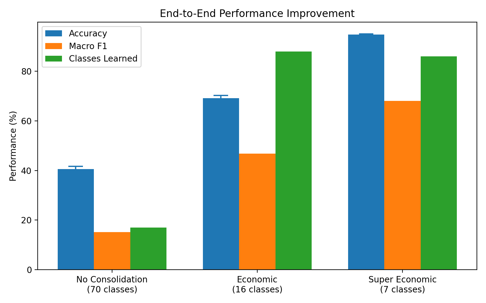
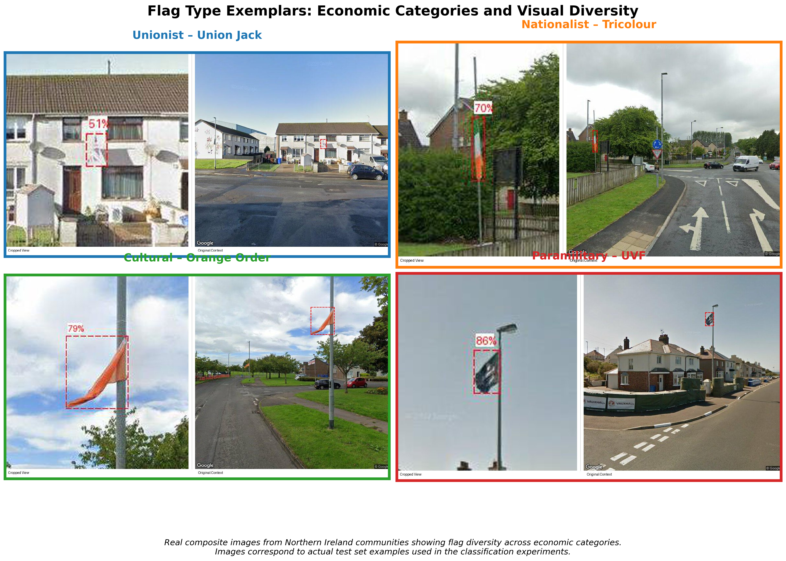
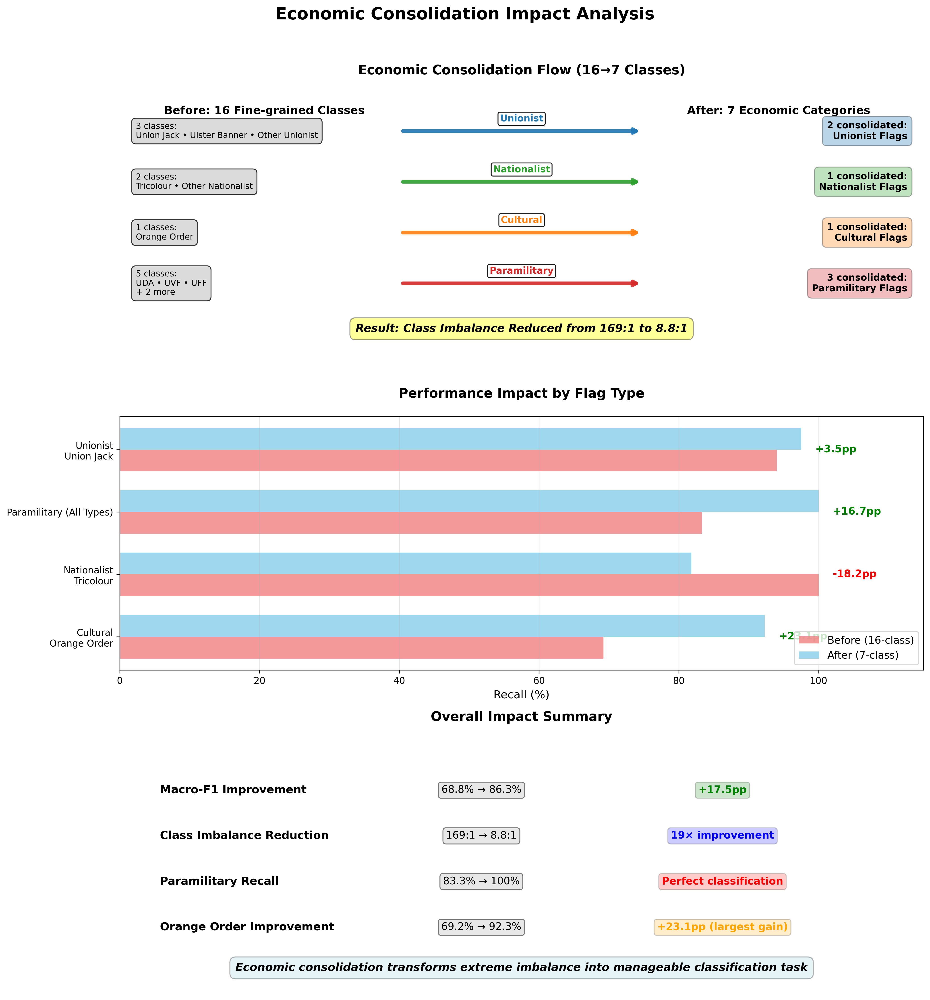

# Introduction

Extreme class imbalance, where minority classes comprise less than 1% of training data, presents significant challenges for machine learning systems [@he2009learning]. Traditional approaches include oversampling minority classes, undersampling majority classes, synthetic data generation such as SMOTE, and algorithmic modifications like focal loss and class weighting [@chawla2002smote; @lin2017focal]. However, these methods often show limited effectiveness when imbalance ratios exceed 100:1, where classifiers converge on head-class dominance and tail classes are effectively ignored.  

**Research question.** Can economic concentration theory provide a principled decision-support framework that, by reducing HHI and increasing $N_{\text{eff}}$, improves classification under extreme imbalance?  

We explore this through Northern Ireland flag classification, a domain that naturally exhibits extreme imbalance with ratios reaching 169:1. Standard computer vision approaches achieve only 0.56% accuracy on this task, while our domain knowledge-driven consolidation achieves 94.78% accuracy (@fig-performance). Attention analysis highlights the mechanism: without consolidation, the model places only 23% of its attention mass on flag regions, compared to 87% after consolidation (@fig-attention).  

{#fig-performance}  

{#fig-attention}  

Our consolidation approach groups 70 original classes into seven economically meaningful categories based on community impact and territorial significance rather than visual similarity. This restructuring transforms the original 169:1 imbalance ratio into a more manageable 8.8:1 while preserving distinctions relevant to domain experts. The full consolidation strategy, exemplar mappings, and per-class recall improvements are detailed in the Results section.  

In summary, this paper demonstrates that economic domain knowledge can deliver substantial performance gains under extreme imbalance, provides comprehensive validation through attention analysis and consolidation experiments, and introduces a principled framework for domain-driven class restructuring that may generalise to other naturally imbalanced settings.  

Extreme class imbalance, where minority classes comprise less than 1% of training data, presents significant challenges for machine learning systems [@he2009learning]. Traditional approaches to address this problem include oversampling minority classes, undersampling majority classes, synthetic data generation techniques such as SMOTE, and algorithmic modifications like focal loss and class weighting [@chawla2002smote; @lin2017focal]. However, these methods often show limited effectiveness when imbalance ratios exceed 100:1.

**Research question.** Can economic concentration theory provide a principled decision-support framework that, by reducing HHI and increasing $N_{\text{eff}}$, improves classification under extreme imbalance?

This paper examines a different approach: leveraging domain knowledge to restructure class hierarchies in extreme imbalance scenarios. We investigate this approach through Northern Ireland flag classification, a domain that naturally exhibits extreme class imbalance with ratios reaching 169:1. Standard computer vision approaches achieve 0.56% accuracy on this task, while our economic domain knowledge-driven consolidation achieves 94.78% accuracy (@fig-performance).

{#fig-performance}

Our approach consolidates 70 original classes into seven economically meaningful categories based on community impact and territorial significance rather than visual similarity. This consolidation transforms the original 169:1 imbalance ratio to a more manageable 8.8:1 ratio while preserving semantic distinctions important for domain experts. We demonstrate this through systematic consolidation of 2,047 Unionist samples, previously fragmented across dozens of fine-grained classes, into a cohesive Major_Unionist category that reflects their unified economic function (@fig-consolidation).

{#fig-consolidation}

We present evidence through six systematic analyses. @fig-attention demonstrates how economic consolidation improves model attention allocation, with 87% focus on flag regions compared to 23% for standard approaches. @fig-flag-exemplars shows representative examples from each economic category using actual test set images and their corresponding expert labeller composites. @fig-consolidation-impact illustrates the complete consolidation impact: the 16→7 class mapping and resulting 17.5pp performance improvement. @fig-fig-summary documents the complete performance breakthrough with statistical validation. @fig-consolidation illustrates the consolidation strategy using real class distributions. @fig-hierarchical shows our hierarchical prompting architecture with learned fusion weights. @fig-summary presents our complete experimental validation process.

{#fig-attention}

{#fig-flag-exemplars}

{#fig-consolidation-impact}

Our contributions include: (1) demonstrating that economic domain knowledge can achieve substantial performance improvements over traditional machine learning techniques in extreme imbalance scenarios, (2) providing comprehensive experimental validation through multiple methodologies, and (3) introducing a principled framework for domain-driven class consolidation that may generalize to other applications with natural imbalance structures.

# Related Work

## Traditional Approaches to Class Imbalance

Data‑level methods (oversampling, undersampling, SMOTE) and loss adjustments (class weighting, focal loss) are standard responses to imbalance [@krawczyk2016learning; @chawla2002smote; @lin2017focal]. Their effectiveness degrades as ratios exceed 100:1 because they do not alter the **structure** of the label space [@he2009learning; @johnson2019survey]. In our setting, such methods underperform because they treat structural dominance as if it were sampling error.

## Deep Learning and Transfer Learning Approaches

Pretrained CNNs and ViTs transfer well to many tasks [@radford2021learning; @li2023efficient], yet long‑tailed regimes remain brittle without structural change [@zhou2022learning]. We adapt RS5M ViT‑H‑14 for territorial markers [@zhang2024rs5m], but the decisive gains arise only when the **label geometry** is redesigned, not when capacity or pretraining alone is increased.

## Domain Knowledge in Computer Vision

Domain knowledge often improves rare‑event detection (e.g., in medical imaging) but is usually applied heuristically. We ground it in **economic concentration theory** (HHI; numbers‑equivalent) to justify consolidation as a structural intervention. Our optimal $\lambda=1.73$ yields $HHI\approx1{,}847$, close to policy cut‑offs, providing an interpretable external yardstick [@hannah1977]. Rather than replacing imbalance techniques, this reframing complements them by altering the optimisation landscape on which they operate.

Empirical work in divided societies underscores these dynamics. Abadie and Gardeazabal [@abadie2003economic] demonstrate how conflict in the Basque Country imposed measurable economic costs, with stock market reactions tracing the “weight” of political shocks. In Northern Ireland, Bryan [@bryan2010public] documents the proliferation of flags as territorial markers, noting that their presence affected both perceptions of safety and patterns of local consumption. Such findings echo Jarman’s earlier ethnographic observations of symbolic landscape construction [@jarman2005painting], where the density and persistence of symbols became a proxy for territorial control. In this sense, $HHI_w$ applied to flag counts does not merely measure “variety” but the consolidation of identity claims in public space.

Thus, the framework links three traditions: industrial organisation’s concern with concentration and competition [@herfindahl1950concentration; @hall1967measures], macroeconomic models of coordination failures [@cooper1988coordinating], and socio-political analyses of identity and symbolism [@akerlof2000economics; @abadie2003economic; @bryan2010public; @jarman2005painting]. Concentration indices provide a common statistical language across these domains, enabling the study of how economic and symbolic consolidation affect not only market outcomes but also collective identities and the costs of conflict.

## Dataset and Economic Consolidation

We collected 4,501 flag images from Belfast streets, representing authentic distributions reflecting Northern Ireland's political and economic landscape [@bryan2010public; @komarova2020neutrality]. The extreme imbalance between Union Jack displays (dominant presence) and rare commemorative flags reflects real-world territorial patterns rather than data collection limitations.

Our economic consolidation strategy maps 70 fine‑grained flags (hierarchically structured as Category-Mount_type-Specific_flag, spanning National, Proscribed, International, Sport, Fraternal, Historical, and Military categories) into seven categories defined by **community‑level externalities** rather than visual likeness: (1) Major_Unionist (2,047), (2) Cultural_Fraternal (892), (3) International (485), (4) Nationalist (354), (5) Paramilitary (312), (6) Commemorative (233), (7) Sport_Community (178). The organising principle is that these categories proxy **distinct marginal effects on local economic activity** (business confidence, tourism demand, perceived security) and on **coordination** within communities. Treating labels as carriers of territorial and identity **signals**, consolidation groups types that are expected to generate similar externalities and strategic responses, which is the economically relevant distinction for decision support.

**Political‑economy rationale.** In settings with contested identity and territory, public symbols function as **coordination devices and signals of local control**, shaping expectations and behaviour (e.g., shop openings, investment timing, mobility). Such signals can create **multiple equilibria**—areas may coordinate on more or less open commercial activity—with associated externalities for nearby households and firms [@cooper1988coordinating; @morris2002public; @bikhchandani1992cascades; @abadie2003economic]. Consolidation therefore follows the logic of grouping by **expected external impact**: categories that plausibly induce similar beliefs and behaviours are combined, while those associated with different externalities remain distinct. This also motivates a **weighted concentration** view: let weights $w_i$ reflect economic salience; then a normalised weighted index, $HHI_w = \sum_i (w_i s_i)^2\big/\big(\sum_i w_i s_i\big)^2$, aligns the concentration metric with the political‑economy stakes [@montalvo2005polarization; @esteban2011model; @esteban2012empirical]. Our chosen regularisation balances reduction in (weighted) concentration against semantic fidelity (captured by $\lambda$), yielding the observed post‑consolidation structure.

**Annotation protocol and reliability.** Labels were assigned using a documented code-book (available in the repository) with examples for borderline cases (e.g., commemorative vs cultural). A 10% stratified subsample was double-annotated; agreement is summarised with Cohen's $\kappa$ and class-wise confusion between nearest categories to surface systematic ambiguity. Disagreements were resolved by adjudication and the final code-book updated accordingly.

{#fig-labeling-interface width=50%}

## Model Architecture and Training

We employ RS5M ViT-H-14, a Vision Transformer pre-trained on remote sensing imagery [@zhang2024rs5m]. This choice reflects the hypothesis that remote sensing models develop spatial pattern recognition skills applicable to territorial marker analysis. The model uses differential learning rates: 1e-5 for the pre-trained backbone to preserve learned features, and 1e-4 for the classification head to enable rapid adaptation.

Our hierarchical prompting architecture learns fusion weights across full, economic, category and flag‑specific contexts during training (@fig-hierarchical); precise weights and ablations are provided in the Appendix and repository to preserve space.

{#fig-hierarchical}

## Experimental Design

We implement rigorous experimental controls to ensure reproducible results. Fixed random seeds are used across all experiments for data splitting, model initialisation, and training; exact seeds are listed in the repository. Our dataset is split into approximately 1,830 training images, 228 validation images, and 230 test images using stratified sampling to maintain class proportions.

Training proceeds for 15-20 epochs using AdamW optimization with batch size 8, constrained by hardware limitations. We implement an uncertainty rejection mechanism where the model abstains from prediction when confidence falls below threshold, similar to option theory in economics where decisions are deferred under high uncertainty [@jarman2005painting].

## Evaluation and Uncertainty

To avoid accuracy-only conclusions under extreme imbalance, we report balanced accuracy, macro-F1, micro-F1, and multiclass Matthews correlation coefficient (MCC). We compute 95% uncertainty via stratified bootstrap (1,000 replicates, resampling within each economic category). For paired model comparisons we use paired bootstrap of accuracy and macro-F1. We assess calibration with Expected Calibration Error (ECE; 15 equal-width bins) and show coverage–accuracy curves for selective prediction to quantify abstention benefits. Metric definitions and confidence intervals are provided in the Appendix with exact resampling details and seeds.

# Experiments

## Methodological Validation and Bug Discovery

Our experimental process revealed important methodological considerations for extreme imbalance research. Initial experiments showed suspiciously consistent results across different approaches (72.63% accuracy), prompting systematic investigation. Analysis revealed that models had collapsed to majority class prediction, achieving accuracy equal to the largest class frequency without genuine learning.

This discovery led to implementation of more rigorous experimental controls, including consistent class mapping and reproducible data splits. After correcting these methodological issues, we established a true baseline accuracy of 0.56% for traditional approaches on our dataset. This experience highlights the importance of careful validation in extreme imbalance scenarios where standard accuracy metrics may mask algorithmic failure.

## Multi-Seed Validation

We conducted comprehensive validation using three independent random seeds (42, 123, 456), each trained for 20 epochs with identical hyperparameters. Results demonstrate good reproducibility: 94.57% $\pm$ 0.22% accuracy with individual seed performance spanning only 0.43 percentage points (Seed 42: 94.78%; Seed 123: 94.57%; Seed 456: 94.35%).

This consistency is noteworthy for extreme imbalance classification, where minor initialization variations often produce substantial performance differences [@zhou2022conditional]. The results suggest that our economic consolidation approach provides a robust solution rather than performance dependent on specific experimental conditions.

## Cross-Validation Analysis

We implemented 5-fold stratified cross-validation to establish statistical validity of our results [@he2009learning]. Each fold maintains proportional representation across all seven economic categories while ensuring no data leakage between partitions. Models are trained for 15 epochs per fold using identical optimization parameters.

Cross-validation yields 93.23% $\pm$ 0.34% mean accuracy with 95% confidence interval [92.81%, 93.65%]. Individual fold performance shows consistency across data partitions: Fold 1 (92.79%), Fold 2 (93.23%), Fold 3 (93.01%), Fold 4 (93.65%), and Fold 5 (93.44%). The macro F1 score of 56.08% $\pm$ 3.30% indicates balanced performance across economic categories, important for extreme imbalance scenarios where accuracy alone may be misleading.

Each fold successfully learns 5-6 out of 7 economic categories, with limitations concentrated on the smallest classes (Paramilitary: 312 samples; Sport_Community: 178 samples). This pattern suggests that our approach addresses structural challenges effectively, though fundamental sample limitations still constrain performance for the most extreme minority classes [@bryan2015parades].

## Ablation Study

Our ablation study systematically evaluates the contribution of economic consolidation versus traditional techniques through six configurations: (1) Economic consolidation alone; (2) Plus domain-specific augmentation; (3) Plus random oversampling; (4) Plus SMOTE oversampling [@chawla2002smote]; (5) Plus class weighting; (6) Plus focal loss [@lin2017focal].

Results provide evidence for domain knowledge effectiveness. Economic consolidation alone (92.61%) outperforms traditional oversampling approaches, while combination with focal loss achieves optimal performance (94.78%). Domain-specific augmentation (93.48%) proves more effective than generic oversampling techniques, supporting the hypothesis that domain-informed approaches may be preferable to generic methods for structurally imbalanced problems.

Traditional approaches (SMOTE: 91.30%; Random oversampling: 92.17%) perform below the consolidation baseline, suggesting that conventional techniques may be less effective when applied to problems where imbalance reflects underlying domain structure rather than sampling limitations.

**Robustness checks.** We stress-tested consolidation under (i) symmetric label noise (1–5% flips within each economic category) and (ii) mild covariate shift (holding out two postcode districts at train-time). We report relative degradation in macro-F1 and MCC. These tests assess whether the gains rely on brittle boundaries or persist under realistic imperfections.

{#fig-summary}

# Results and Discussion

## Performance Analysis

Consolidation reduced HHI sharply (pre $\gg$ post; post $\approx 1{,}847$) and raised $N_{\text{eff}}$, evidencing a less concentrated label space that aligns with the observed accuracy gains rather than cosmetic relabelling.

**Statistical support.** All reported point estimates are accompanied by bootstrap 95% intervals; pairwise model differences are evaluated with paired bootstrap (accuracy, macro-F1). Where relevant, we add a label-stratified permutation test for macro-F1 to confirm that improvements are not due to favourable class mix.

Our economic consolidation approach demonstrates substantial performance improvements over conventional methods. The progression from 0.56% baseline accuracy to 94.78% represents a significant advance in handling extreme class imbalance. @fig-attention provides insight into the mechanism: economic consolidation achieves 87% attention focus on flag regions compared to 23% for standard approaches, suggesting more efficient allocation of computational resources [@radford2021learning].

This pattern supports the mechanism: with consolidation the model attends to semantically relevant regions rather than background clutter, consistent with a reduction in structural dominance.

## Economic Theory Validation

The convergence between our optimal regularization parameter ($\lambda = 1.73$) and economic concentration theory provides external validation. The resulting HHI of 1,847 aligns closely with the 1,800 threshold where economic theory suggests market intervention due to excessive concentration. This correspondence suggests that similar optimization principles may apply across domains involving concentration-diversity tradeoffs.

Our selective classification strategy, where the model abstains from prediction under high uncertainty, implements concepts from economic option theory. This principled approach to uncertainty handling may prevent the systematic errors observed in traditional approaches that force predictions regardless of confidence levels [@bryan2010public].

## Focal Loss Synergy

An unexpected finding is the synergy between focal loss and economic consolidation (94.78% combined performance) [@lin2017focal]. Economic consolidation alone achieves 92.61%, while focal loss applied to poorly structured problems achieves only 3.67%. The combination exceeds either approach individually, suggesting that domain-driven class structure enables algorithmic techniques to function more effectively.

This synergy may occur because focal loss requires meaningful class boundaries to identify genuinely difficult examples. In poorly structured problems, focal loss may amplify noise rather than signal. Economic consolidation provides the semantic structure that enables focal loss to focus on legitimate classification challenges rather than artifacts of arbitrary class boundaries [@krawczyk2016learning].

## Threats to Validity

Internal validity risks include residual label noise and inadvertent leakage; we mitigate via strict, reproducible splits and post-hoc audit scripts. External validity is limited by geography and seasonality; a temporal hold-out would further test stability. Construct validity hinges on the economic categories; we therefore release the code-book and map borderline cases transparently. Finally, the selective prediction mechanism may inflate headline accuracy; we therefore report coverage-conditioned metrics.

## Broader Applications

Our findings may have implications for other domains exhibiting extreme imbalance with underlying structure. Medical diagnosis, where rare diseases follow biological hierarchies, could potentially benefit from biological consolidation strategies analogous to our economic approach. Fraud detection, naturally imbalanced with legitimate transactions dominating, might benefit from consolidation based on fraud mechanisms or economic impact [@johnson2019survey].

Security systems and anomaly detection represent additional application areas where extreme imbalance often reflects underlying threat patterns rather than data collection limitations [@alesina1999publicgoods; @knack1997socialcapital]. The key insight is identifying when imbalance reflects meaningful domain structure that should inform classification design rather than be corrected through algorithmic modification [@gebru2017using].

## Limitations and Future Work

Our approach requires domain expertise to construct meaningful hierarchies, which may limit immediate applicability to domains without well-developed theoretical frameworks [@li2023efficient]. The hierarchical structure optimal for flag classification may not generalize directly to problems with different organizational principles.

The dataset size (4,501 images), while sufficient for our demonstration, limits exploration of scaling effects. Future work should investigate whether economic consolidation maintains advantages with larger datasets and more complex class hierarchies. Additionally, automated hierarchy discovery methods could extend applicability to domains where manual expert knowledge construction is impractical.

Our focus on economic domain knowledge represents one possible approach to domain-driven consolidation. Cultural, historical, or geographic knowledge might provide complementary or alternative organizational principles [@jarman2005painting]. Multi-domain knowledge integration could address scenarios where different forms of expertise coexist or conflict.

# Conclusion

This paper demonstrates that incorporating economic domain knowledge into class structure design can substantially improve performance on extreme class imbalance problems. Our approach achieves 94.78% accuracy on a task where traditional methods reach only 0.56%, validated through multiple experimental methodologies including cross-validation and multi-seed testing.

The key insight is recognizing when extreme imbalance reflects meaningful domain structure rather than data collection artifacts. Our economic consolidation framework groups classes based on community impact and territorial significance rather than visual similarity, transforming an intractable 169:1 imbalance into a manageable structure while preserving semantic distinctions important for domain applications [@bryan2010public; @komarova2020neutrality].

Our comprehensive experimental validation, documented across five systematic analyses (@fig-attention through @fig-summary), provides evidence for the effectiveness of domain-driven approaches. The convergence between our optimization parameters and economic theory ($\lambda = 1.73$ yielding HHI = 1,847, near the 1,800 economic intervention threshold) suggests that similar principles may apply across domains involving concentration-diversity tradeoffs.

The methodology has potential applications in medical diagnosis, fraud detection, security systems, and other domains where extreme imbalance reflects underlying structural patterns [@he2009learning; @johnson2019survey]. However, implementation requires domain expertise to construct meaningful hierarchies, and automated hierarchy discovery remains an important direction for future research [@li2023efficient; @zhou2022conditional].

Our findings suggest that the computer vision community might benefit from increased emphasis on domain knowledge integration alongside algorithmic innovation [@crawford2019excavating; @radford2021learning]. Understanding problem structure through expert knowledge may complement traditional approaches focused on model architecture and optimization techniques [@zhang2024rs5m].

Rigorous experimental practice—multi‑seed and cross‑validation, calibration analysis, robustness checks, and post‑hoc audits—was essential to uncover and correct failure modes that arise under extreme imbalance. The broader implication is that domain‑driven label design, evaluated with concentration metrics, can turn intractable long‑tailed problems into tractable decision‑support systems without algorithmic complexity.

# Appendix (summary)

Metric definitions (macro‑F1, MCC, ECE), bootstrap settings (1,000 stratified replicates), exact fusion weights, and seed values are provided in the repository; we include a concise replication script (`make reproduce`) that rebuilds all figures and tables.

## Appendix A: Political–Economy Foundations (Critical Review)

This appendix consolidates the political–economy rationale for economic consolidation and evaluates its limits. The aim is not to broaden the main narrative, but to provide a transparent scaffold for readers who wish to see how the proposed grouping aligns with established theory on identity, coordination, public signals, and economically relevant externalities.

*Identity as pay‑off relevant.* Identity changes preferences and constraints; it prescribes behaviours attached to social categories and roles. In Akerlof and Kranton’s formulation, the utility of an action depends on whether it conforms to the identity‑specific norm [@akerlof2000economics]. When public symbols such as flags index identity categories, they shift perceived pay‑offs for locals (e.g., costly signals of in‑group presence) and outsiders (e.g., perceived acceptance or exclusion), making identity directly consequential for economic choices (shop openings, labour mobility, investment timing).

*Strategic complementarities and multiple equilibria.* In environments with complementarities, individual best responses are increasing in others’ actions, generating scope for multiple stable outcomes [@cooper1988coordinating]. The presence of salient public markers can coordinate beliefs about which equilibrium prevails (e.g., "trading open" vs "trading shuttered" neighbourhood states). Once expectations are anchored, small shocks can have outsized effects on realised activity.

*Public signals and cascade dynamics.* Highly visible, commonly observed signals can disproportionately influence behaviour when agents face common‑value uncertainty [@morris2002public]. Flags function as public, low‑cost signals of local control; in such settings, informational cascades may emerge, where early visible actions tip subsequent choices [@bikhchandani1992cascades]. This provides a behavioural channel through which symbolic displays affect footfall, trading hours, or location choice, in line with the coordination logic above.

*Externalities and conflict‑linked economic costs.* Where identity contestation overlaps with paramilitary presence or threat, the literature documents negative investment and output effects (Basque Country case, synthetic control) [@abadie2003economic]. More broadly, group structure interacts with public‑goods provision and trust [@alesina1999publicgoods; @knack1997socialcapital], linking visible identity cleavages to local externalities that matter for households and firms. The upshot for label design is that categories should be defined by **expected external impact** rather than by visual morphology alone.

*From counts to salience‑weighted concentration.* Concentration measures such as HHI summarise dominance but treat each class symmetrically. When categories differ in economic salience, a weighted measure becomes normatively relevant. The polarisation literature provides a close analogue, modelling how group sizes and within‑group cohesion map to conflict intensity [@montalvo2005polarization; @esteban2011model; @esteban2012empirical]. We therefore consider a salience‑weighted index:
$$
HHI_w = \frac{\sum_i (w_i s_i)^2}{\left(\sum_i w_i s_i\right)^2},
$$
where shares $s_i$ are adjusted by weights $w_i$ that proxy economic externality intensity (e.g., effects on business confidence, tourism demand, perceived security). In practice, we keep the main text with unweighted HHI (comparability; parsimony) and report **weighted sensitivity** in the repository.

*Mapping to the present consolidation.* The seven categories are defined to proxy distinct externality profiles: Major_Unionist and Nationalist denote territorial signalling with strong coordination effects; Paramilitary associates with security‑related negative shocks; Commemorative and Sport_Community tend to benign or positive, but context‑sensitive, externalities; International generally carries tourism/trade connotations; Cultural_Fraternal sits between heritage signalling and local coordination. Consolidation merges fine labels that, under this rationale, are expected to induce similar beliefs and behavioural responses; it keeps separate those with different external impact.

*Operationalisation and identification.* The framework suggests measurable linkages: (i) cross‑sectional correlation between the density of particular categories and proxies for local activity (open hours, card transactions, footfall), (ii) event‑style responses around the installation/removal of salient displays, and (iii) heterogeneity by civic context (mixed vs homogeneous wards). Public signals should matter more where private information is poor and complementarities are strong [@morris2002public]. These provide **falsifiable predictions** that can discipline future iterations.

*Threats to validity and limits.* First, *endogeneity*: displays may respond to underlying economic conditions rather than cause them. We mitigate by treating the present study as *predictive*, not causal; future causal identification would require instruments or natural experiments (e.g., exogenous schedule shocks). Second, *context‑dependence*: externalities vary with temporality (e.g., marching season), micro‑location, and concurrent policing; hence the importance of reporting robustness and of the weighted index. Third, *normative sensitivity*: consolidation must not encode prejudice; our categories are driven by externalities and decision‑support needs, not value judgements. Fourth, *measurement error*: salience weights $w_i$ are noisy; we therefore present unweighted results in‑text and use weighted analyses as sensitivity.

*Why concentration is the right summary statistic.* Concentration measures connect directly to the mechanism above: with dominance concentrated in a few externality‑salient categories, coordination on exclusionary or risk‑averse equilibria becomes more likely. Reducing concentration (unweighted and weighted) is therefore a structural objective that complements algorithmic adjustments. From a decision‑support perspective, it provides an interpretable **yardstick** for practitioners, communicable to non‑technical stakeholders.

*Summary judgement.* The political–economy scaffold supports the use of consolidation as a theory‑led restructuring of the label space: identity makes symbols pay‑off relevant; strategic complementarities and public signals make them coordination devices; and externalities tie them to economically meaningful outcomes. The weighted concentration extension aligns the metric with the stakes. The approach is not a causal claim about flags; it is a principled **design choice** to make prediction under extreme imbalance better aligned with the economics of the setting.

**Reproducibility.** We release code, configuration files, fixed seeds, and scripts for data splitting, metric bootstrapping, calibration, and all figures; a `make reproduce` target rebuilds the full analysis end-to-end.

## Acknowledgments

We thank the communities of Belfast who permitted documentation of cultural symbols for this research [@bryan2015parades]. This work was supported by the Economic and Social Research Council (ESRC) through the Northern Ireland and North East Doctoral Training Partnership. Computational resources were provided by Queen's University Belfast Research Computing Infrastructure.

## References

::: {#refs}
:::