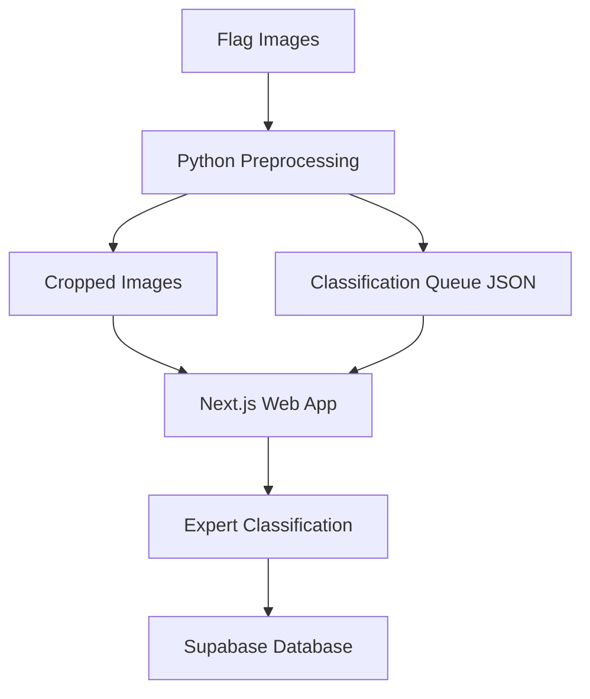

# Expert Flag Labeler

A web application for expert-based hierarchical classification of flags in Northern Ireland, designed for academic research purposes.

**IMPORTANT**: This repository contains **only code**, not image data. The images are derived from stree
t-level imagery services with specific licensing restrictions and cannot be shared publicly.

## Project Overview

This application allows authenticated experts to classify and categorize flags appearing in images from various locations across Northern Ireland. The collected data is stored in Supabase and will be used for academic research on flag displays and their contexts.

### Key Features

- Secure expert authentication
- Side-by-side image viewing that shows both the cropped flag and its original context
- Image classification interface with zoom capabilities
- Hierarchical flag categorization system
- Review flagging for uncertain cases
- Progress tracking for classification work
- Reference examples for flag identification
- Mobile-friendly responsive design

## Documentation

All project documentation is organized in the `docs` folder:

- [Image Processing Guide](./docs/image_processing_guide.md) - Complete guide to image preparation, sampling and integration
- [Deployment Instructions](./docs/deployment_instructions.md) - Steps to deploy the application
- [Troubleshooting Guide](./docs/troubleshooting_guide.md) - Solutions for common issues
- [Methodology](./docs/methodology.pdf) - Academic methodology behind the project
- [Invitation Email](./docs/invitation_email.md) - Template for inviting experts

## Technology Stack

- **Frontend**: Next.js 15 with React
- **Styling**: Tailwind CSS with shadcn/ui components
- **Database**: Supabase
- **Deployment**: Vercel
- **Image Processing**: Python with PIL for preprocessing

## Getting Started

### Prerequisites

- Node.js 18.x or higher
- npm or yarn
- Python 3.6+ (for image preprocessing)
- Supabase account and project

### Environment Setup

Create a `.env.local` file in the root directory with the following variables:

```
NEXT_PUBLIC_SUPABASE_URL=your_supabase_url
NEXT_PUBLIC_SUPABASE_ANON_KEY=your_supabase_anon_key
```

### Installation

1. Clone the repository
   ```bash
   git clone https://github.com/your-username/expert-flag-labeler.git
   cd expert-flag-labeler
   ```

2. Install dependencies
   ```bash
   npm install
   ```

3. Run the development server
   ```bash
   npm run dev
   ```

4. Open [http://localhost:3000](http://localhost:3000) with your browser

## Quick Reference: Image Processing Workflow

The complete workflow for preparing and serving images:

1. **Preprocess images** with the Python script:
   ```bash
   python scripts/prepare_images_for_classification.py --side-by-side --copy-to-public
   ```

2. **Generate image list** for the app:
   ```bash
   node scripts/generate-image-list.js
   ```

3. **Copy to static directory** for reliable serving:
   ```bash
   node scripts/copy-images-to-static.js
   ```

4. **Verify composite images** if needed:
   ```bash
   node scripts/verify-composite-images.js
   ```

For detailed options and explanations, see the [Image Processing Guide](./docs/image_processing_guide.md).

## Project Structure

- `/src/app` - Next.js app router pages and API routes
- `/src/components` - Reusable React components 
- `/src/lib` - Utility functions and libraries
- `/public` - Static assets including processed images
- `/scripts` - Python and JavaScript scripts for image preprocessing
- `/data` - Data directory (not committed to repo)
  - `/data/true_positive_images` - Original images with bounding boxes
  - `/data/cropped_images_for_classification` - Processed images

## System Architecture



## License

Code: MIT License

Images: Not included in this repository. The images used with this application are derived from street-level imagery services and are subject to their respective licensing terms. These images cannot be shared or redistributed.

## Acknowledgements

This project is part of academic research on cultural symbols in Northern Ireland.