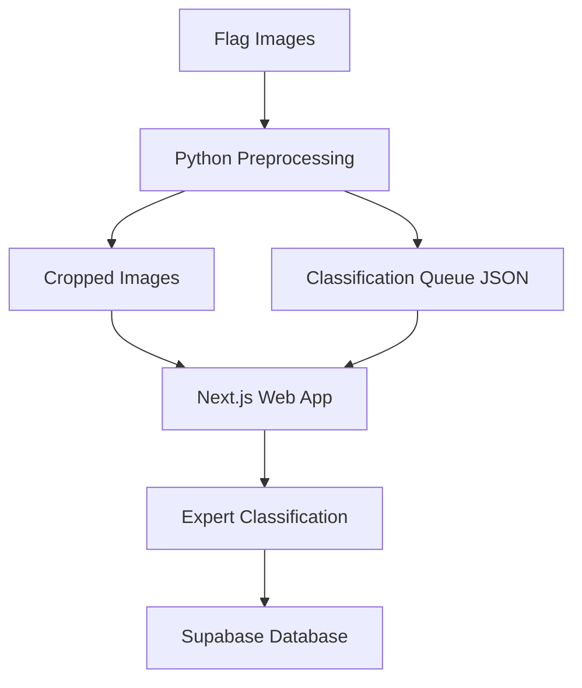

# Expert Flag Labeller

A web application for expert classification and labeling of flags in Northern Ireland, designed for academic research purposes.

## Project Overview

This application allows authenticated experts to classify and categorize flags appearing in images from various locations. The data collected is stored in Supabase and will be used for academic research on flag displays and their contexts.

### Key Features

- Secure expert authentication
- Image classification interface with zoom capabilities
- Structured flag categorization system
- Review flagging for uncertain cases
- Statistics tracking for labeling progress
- Reference examples for flag identification

## Technology Stack

- **Frontend**: Next.js 14 with React
- **Styling**: Tailwind CSS with shadcn/ui components
- **Database**: Supabase
- **Deployment**: Vercel

## Getting Started

### Prerequisites

- Node.js 18.x or higher
- npm or yarn
- Supabase account and project

### Environment Setup

Create a `.env.local` file in the root directory with the following variables:

```
NEXT_PUBLIC_SUPABASE_URL=your_supabase_url
NEXT_PUBLIC_SUPABASE_ANON_KEY=your_supabase_anon_key
```

### Installation

1. Clone the repository
   ```bash
   git clone https://github.com/your-username/flag-labeller.git
   cd flag-labeller
   ```

2. Install dependencies
   ```bash
   npm install
   # or
   yarn install
   ```

3. Run the development server
   ```bash
   npm run dev
   # or
   yarn dev
   ```

4. Open [http://localhost:3000](http://localhost:3000) with your browser

5. (Optional) Preprocess images for classification
   ```bash
   python scripts/prepare_images_for_classification.py --auto-threshold
   ```

## Project Structure

- `/src/app` - Next.js app router pages
- `/src/components` - Reusable React components
- `/src/lib` - Utility functions and libraries
- `/public` - Static assets including flag examples
- `/scripts` - Python scripts for image preprocessing
- `/data` - Data directory
  - `/data/true_positive_images` - Original images with bounding boxes
  - `/data/cropped_images_for_classification` - Processed single-box images

## Image Preprocessing

The application includes a preprocessing pipeline to prepare multi-box flag images for classification. Since the classification interface is designed to handle one box per image, we use these scripts to intelligently crop and prepare images.

### Scripts Location

Preprocessing scripts are located in:
- `/scripts/prepare_images_for_classification.py` - Standalone script for image preprocessing
- `/scripts/image_viewer_app.py` - Optional GUI for viewing and exploring images with multiple bounding boxes

### Preprocessing Workflow

1. **Dataset Analysis**: Analyzes the dataset to gather statistics about box sizes, positions, and confidence scores
2. **Intelligent Cropping**: Creates individual cropped images centered on each bounding box
3. **Distant Flag Handling**: Special handling for small boxes that might be distant flags
4. **Queue Generation**: Creates a JSON file with metadata for the classification app
5. **Context Preservation**: Adds padding around boxes and highlights the detection area

### Running the Preprocessing Script

```bash
cd /User/quinference/expert-flag-labeller
python scripts/prepare_images_for_classification.py --stats --auto-threshold
```

#### Command-line Options

- `--min-confidence FLOAT` - Minimum confidence score threshold (default: 0.3)
- `--min-size FLOAT` - Minimum relative size as percentage of image (default: 0.005)
- `--output-dir DIR` - Output directory for cropped images
- `--queue-file FILE` - Output JSON file path
- `--random-sample INT` - Randomly sample N images from each town
- `--max-per-town INT` - Maximum number of images to process per town
- `--auto-threshold` - Automatically adjust thresholds based on image analysis
- `--highlight` - Highlight the bounding box in the cropped image
- `--stats` - Show detailed statistics about the dataset
- `--debug` - Enable debug output

### Output Files

The preprocessing pipeline generates:
- A directory of cropped images at `/data/cropped_images_for_classification/`
- A JSON queue file at `/data/classification_queue.json`

The Next.js app automatically uses this queue for classification.

## Authentication

The application uses a simple username/password authentication system with predefined expert accounts. In production, credentials are securely stored and not exposed in the codebase.

## Data Model

### Classifications

Each classification includes:
- Image identifier
- Town/location
- Primary flag category
- Specific flag type
- Display context
- User context
- Confidence level (1-5)
- Expert identifier
- Timestamp

### Flag Categories

Flags are organized into academic categories:
- National
- Fraternal
- Sport
- Military
- Historical
- International
- Proscribed

## API Routes

- `/api/images-static` - Retrieves images for classification (now uses the classification queue from preprocessing)
- `/api/classifications` - Handles saving and retrieving classifications
- `/api/current-user` - Gets information about the current authenticated user

## System Architecture



## Deployment

The application is deployed on Vercel and connected to a Supabase project for data storage.

### Deployment Checklist

1. Ensure all environment variables are set in Vercel
2. Verify Supabase project is active (not paused)
3. Check that authentication is working properly
4. Confirm data is being saved correctly

## Contributing

## License
MIT Licence

## Acknowledgements
