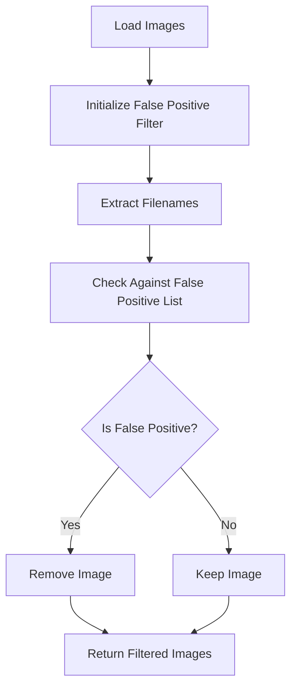

# False Positive Filtering System

## Overview

The Expert Flag Labeler now includes an advanced false positive filtering system that uses manually curated data to remove low-quality images from the classification pipeline. This system significantly improves the quality of images presented to experts by filtering out images that have been identified as false positives through manual review.

## Data Sources

### Pickle Files
The system uses three pickle files located in `false_positive_checks/`:

1. **`ENNISKILLENlist.pickle`** (3.5MB)
   - Contains 33,864 image file paths
   - Original computer vision processing list

2. **`ENNISKILLENresults.pickle`** (26MB)
   - Contains computer vision classification results
   - NumPy array with shape (33,864, 3)
   - Columns: [filename, base_id, cv_classification]
   - CV had 96.2% false positive rate

3. **`ENNISKILLENresultsCORRECT.pickle`** (2.8MB)
   - Contains manually corrected classifications
   - Pandas DataFrame with 5 columns
   - `flags_correct` column is the authoritative classification
   - Only 1.9% (646 images) are true positives after manual review

## Processing Results

### Manual Review Impact
- **Original CV results**: 1,077 flagged as true positives
- **After manual review**: 646 confirmed true positives
- **Correction**: 431 false positives were removed
- **Overall false positive rate**: 97.7% (33,218 out of 33,864 images)

### Data Quality Improvement
The manual review process corrected 1.5% of classifications, with the most significant impact being:
- Removing over-optimistic computer vision results
- Ensuring only genuine flag sightings are included
- Maintaining high standards for expert classification tasks

## System Architecture

### Core Components

1. **False Positive Filter Service** (`src/lib/false-positive-filter.ts`)
   - Singleton service that loads and manages false positive data
   - Provides filtering methods for image arrays
   - Handles filename normalization and matching

2. **Data Files** (`src/data/`)
   - `false-positives-enniskillen.json`: Complete dataset with metadata
   - `false-positives-lookup.json`: Optimized lookup file for filtering

3. **API Integration**
   - `src/app/api/images-static/route.ts`: Main image serving API
   - `src/app/api/images/route.ts`: Secondary image API
   - Both APIs now filter out false positives before returning images

### Filtering Process



## Usage

### API Response Format
The filtered APIs now return additional metadata:

```json
{
  "success": true,
  "metadata": {
    "total_images": 646,
    "original_count": 5751,
    "filtered_count": 5105,
    "false_positive_filter": {
      "initialized": true,
      "falsePositiveCount": 33218,
      "town": "ENNISKILLEN"
    }
  },
  "images": [...]
}
```

### Key Methods

```typescript
// Check if a single image is a false positive
falsePositiveFilter.isFalsePositive(filename: string): boolean

// Filter an array of images
falsePositiveFilter.filterTruePositives(images: T[]): T[]

// Get filter statistics
falsePositiveFilter.getStats()
```

## Benefits

1. **Improved Data Quality**: Only manually verified true positives are shown
2. **Better Expert Experience**: Experts see higher-quality, relevant images
3. **Reduced False Classifications**: Eliminates computer vision errors
4. **Transparent Filtering**: APIs provide filtering statistics
5. **Scalable System**: Can easily add more towns/datasets

## Future Enhancements

1. **Multi-Town Support**: Extend to other towns beyond ENNISKILLEN
2. **Dynamic Updates**: API to update false positive lists
3. **Quality Metrics**: Track filtering effectiveness over time
4. **Admin Interface**: UI for managing false positive lists

## File Structure

```
src/
├── lib/
│   └── false-positive-filter.ts    # Core filtering service
├── data/
│   ├── false-positives-enniskillen.json  # Complete dataset
│   └── false-positives-lookup.json       # Optimized lookup
└── app/api/
    ├── images-static/route.ts      # Main image API (filtered)
    └── images/route.ts             # Secondary API (filtered)

false_positive_checks/
├── ENNISKILLENlist.pickle         # Original image list
├── ENNISKILLENresults.pickle      # CV results
└── ENNISKILLENresultsCORRECT.pickle # Manual corrections

scripts/
├── process-false-positives-final.py  # Processing script
└── test-false-positive-filter.js     # Testing script
```

## Maintenance

### Adding New Towns
1. Process pickle files using `process-false-positives-final.py`
2. Generate town-specific JSON files
3. Update the filter service to support multiple towns
4. Test with new datasets

### Updating Classifications
1. Re-run the processing script with updated pickle files
2. Regenerate JSON lookup files
3. Restart the application to reload filters

## Testing

Use the test script to verify the system:

```bash
node scripts/test-false-positive-filter.js
```

This will validate:
- False positive data loading
- Filtering accuracy
- API integration
- Performance metrics 